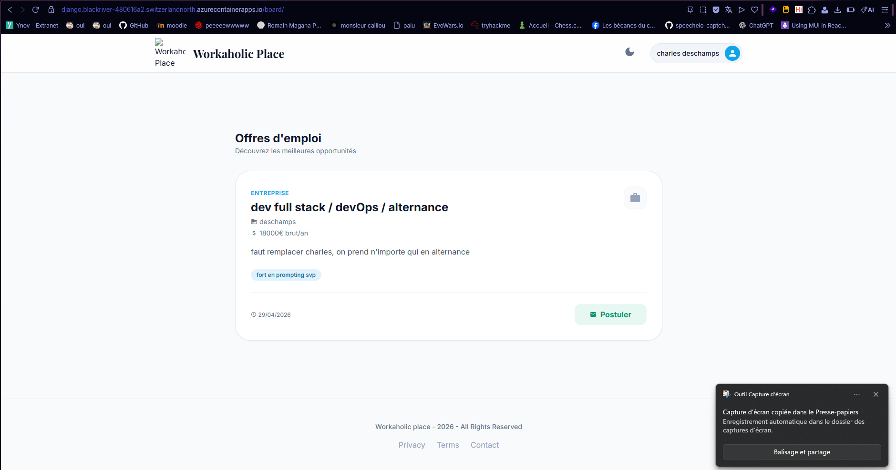
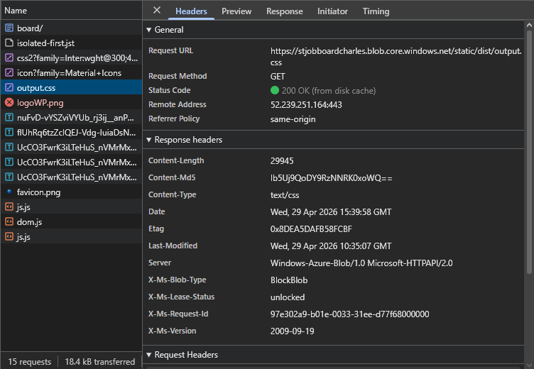

# Django Job Board

Plateforme d'offres d'emploi développée avec Django, permettant aux entreprises de publier des offres et aux candidats de postuler.

**URL de production :** https://django.blackriver-480616a2.switzerlandnorth.azurecontainerapps.io

## Stack technique

- **Backend** : Django 5.2 + PostgreSQL
- **Frontend** : Tailwind CSS
- **Stockage** : Azure Blob Storage
- **Déploiement** : Azure Container Apps + Azure Container Registry

## Lancer en local (sans Docker)

```bash
# Créer et activer l'environnement virtuel
python3 -m venv .venv
source .venv/bin/activate        # Linux/Mac
.\.venv\Scripts\activate         # Windows

# Installer les dépendances
pip install -r requirements.txt
npm install

# Build CSS
npm run build:css

# Migrations et démarrage
python manage.py migrate
python manage.py runserver
```

## Lancer en local (Docker)

```bash
cp .env.example .env  # remplir les variables
docker compose up
```
## screenshot

Offre emploi :


Fichier css :
